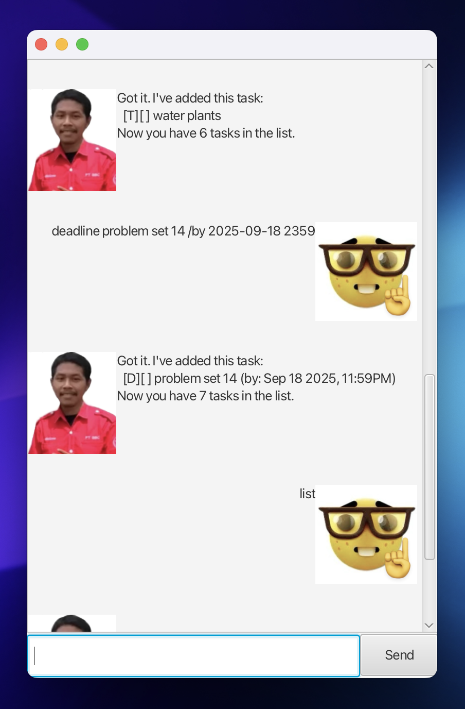

# Udin - Personal Task Manager



Udin is a personal task management application that helps you organize and track your daily tasks. It supports three types of tasks: todos, deadlines, and events, with a modern graphical user interface.

## Features

- ✅ **Task Management**: Create, mark, unmark, and delete tasks
- 📅 **Deadlines**: Set due dates for tasks
- 🎯 **Events**: Schedule tasks with start and end times
- 🔍 **Search**: Find tasks by keywords
- 💾 **Data Persistence**: Tasks are automatically saved and loaded
- 🖥️ **Modern GUI**: Intuitive graphical user interface

## Quick Start

### Prerequisites
- Java 17 or higher
- Gradle (included in the project)

### Running the Application

```bash
./gradlew run
```

The GUI will open automatically with a modern interface featuring:
- Chat-like interaction with Udin
- Task list display
- Easy command input
- Intuitive task management

## How to Use

### Basic Commands

Type these commands in the input field at the bottom of the GUI:

| Command | Description | Example |
|---------|-------------|---------|
| `help` | Show all available commands | `help` |
| `list` | Display all tasks | `list` |
| `bye` | Exit the application | `bye` |

### Task Management

| Command | Description | Example |
|---------|-------------|---------|
| `todo <description>` | Add a todo task | `todo Buy groceries` |
| `deadline <description> /by <date>` | Add a deadline task | `deadline Submit report /by 2024-12-25 1800` |
| `event <description> /from <date> /to <date>` | Add an event task | `event Team meeting /from 2024-12-25 1400 /to 2024-12-25 1600` |
| `mark <number>` | Mark a task as done | `mark 1` |
| `unmark <number>` | Mark a task as not done | `unmark 1` |
| `delete <number>` | Delete a task | `delete 1` |
| `find <keyword>` | Search for tasks | `find meeting` |

### Date Format
- Use format: `yyyy-MM-dd HHmm`
- Example: `2024-12-25 1800` (December 25, 2024 at 6:00 PM)

## Usage Examples

### Adding Tasks
Type these commands in the GUI input field:

**Adding a todo:**
```
todo Buy groceries
```
*Udin responds: "Got it. I've added this task: [T][ ] Buy groceries"*

**Adding a deadline:**
```
deadline Submit project /by 2024-12-30 2359
```
*Udin responds: "Got it. I've added this task: [D][ ] Submit project (by: Dec 30 2024, 11:59PM)"*

**Adding an event:**
```
event Team meeting /from 2024-12-25 1400 /to 2024-12-25 1600
```
*Udin responds: "Got it. I've added this task: [E][ ] Team meeting (from: Dec 25 2024, 2:00PM to: Dec 25 2024, 4:00PM)"*

### Managing Tasks

**View all tasks:**
```
list
```
*Shows all your tasks in the chat area*

**Mark a task as done:**
```
mark 1
```
*Udin responds: "Good boy! This task is all done: [T][X] Buy groceries"*

**Search for tasks:**
```
find meeting
```
*Udin shows: "Here are the matching tasks in your list: [E][ ] Team meeting..."*

## Data Storage

- Tasks are automatically saved to `data/tasks.txt`
- Data persists between application sessions
- Tasks are saved immediately after any modification (add, mark, unmark, delete)

## Error Handling

The application provides helpful error messages for common issues:

- **Invalid task number**: `Invalid task number.`
- **Empty todo description**: `The description of a todo cannot be empty.`
- **Invalid date format**: `Please enter date as yyyy-MM-dd HHmm (e.g. 2019-12-02 1800).`
- **Missing search keyword**: `Please provide a keyword to find.`

## Development

### Running Tests
```bash
./gradlew test
```

### Building the Project
```bash
./gradlew build
```

### Project Structure
```
src/
├── main/java/udin/
│   ├── Udin.java          # Main application class
│   ├── Task.java          # Base task class
│   ├── ToDo.java          # Todo task implementation
│   ├── Deadline.java      # Deadline task implementation
│   ├── Event.java         # Event task implementation
│   ├── TaskList.java      # Task collection management
│   ├── Parser.java        # Command parsing and execution
│   ├── Storage.java       # Data persistence
│   ├── Ui.java           # User interface components
│   ├── MainWindow.java   # GUI controller
│   └── DialogBox.java    # GUI dialog components
└── test/java/udin/       # Comprehensive test suite
```

## Contributing

1. Fork the repository
2. Create a feature branch
3. Make your changes
4. Add tests for new functionality
5. Ensure all tests pass
6. Submit a pull request

## License

This project is part of the CS2103T Software Engineering course.

---

**Happy task managing with Udin! 🎯**
